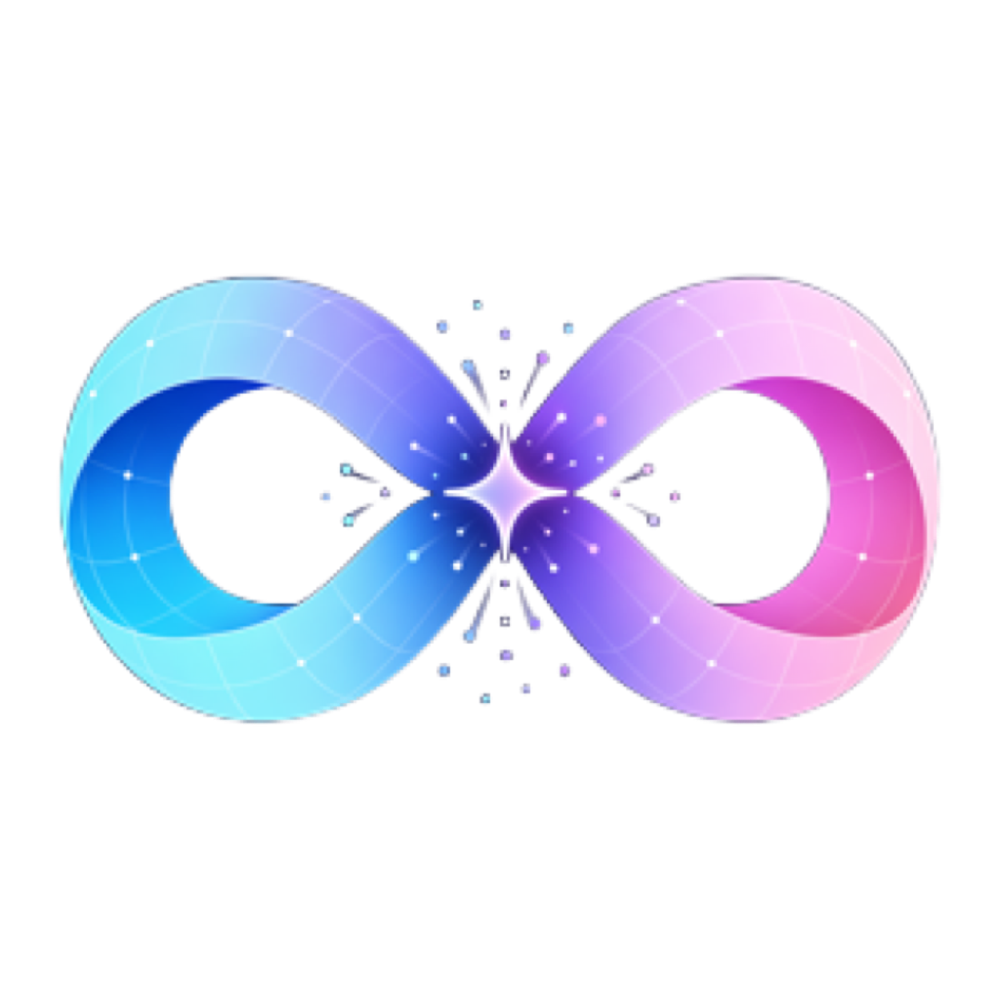
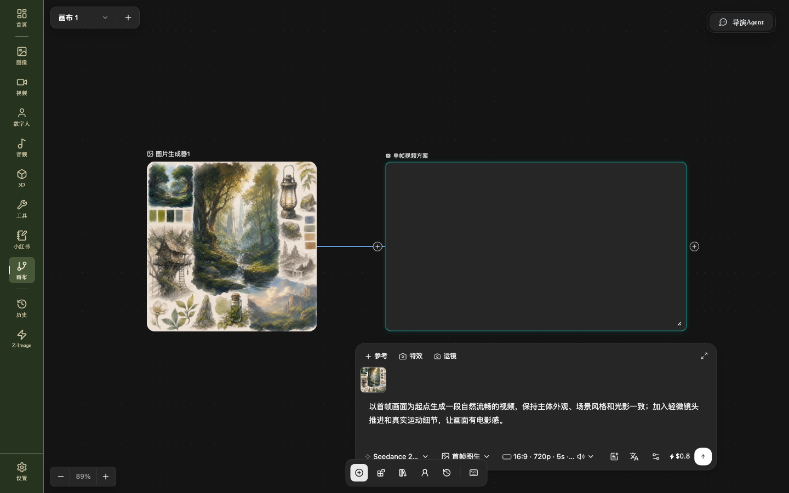
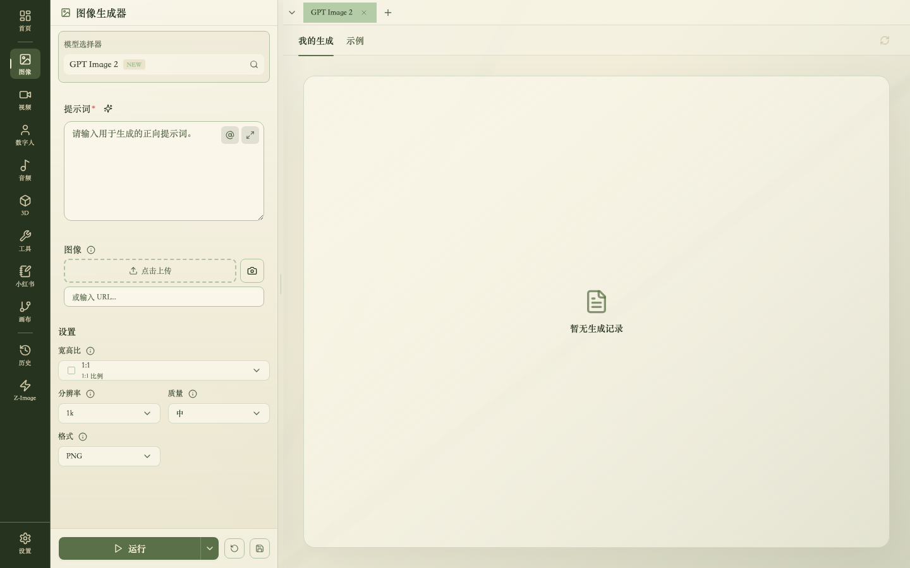
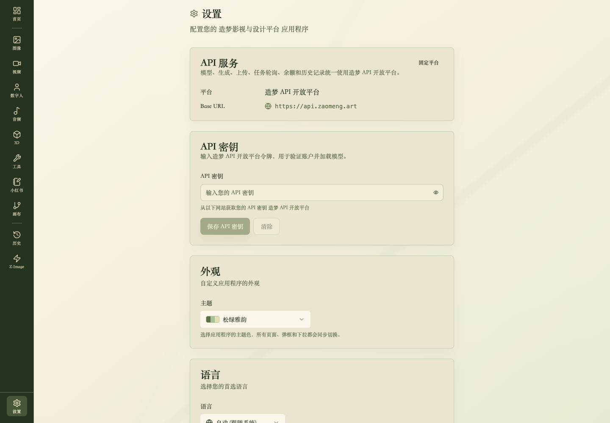

<p align="center">
  
</p>

# 造梦影视与设计工作流

**zmTV** 是一个面向 AI 影视、视觉设计和多媒体生产的桌面工作流画布。它把文本、图片、视频、音频、3D、数字人、分镜和导演 Agent 放在同一张可视化画布中，并通过动态模型参数连接不同生成服务。

[](LICENSE)
[](https://github.com/ddlmanus/zmTV/releases/tag/v2.1.7)
[](https://github.com/ddlmanus/zmTV/actions/workflows/build.yml)
[](https://www.electronjs.org/)
[](https://react.dev/)
[](https://www.typescriptlang.org/)

> 本项目源码公开，仅允许非商业使用。商业使用、SaaS 托管、收费服务、企业内生产部署或基于本项目销售产品，必须获得单独书面授权。详见 [LICENSE](LICENSE)。

## 下载 v2.1.7

在 [GitHub Releases](https://github.com/ddlmanus/zmTV/releases/tag/v2.1.7) 下载已经构建好的安装包，无需自行配置开发环境。

| 平台                | 安装包                                                                                                                                                                                                             |
| ------------------- | ------------------------------------------------------------------------------------------------------------------------------------------------------------------------------------------------------------------ |
| macOS Apple Silicon | [下载 DMG](https://github.com/ddlmanus/zmTV/releases/latest/download/zmTV-Desktop-mac-arm64.dmg)                                                                                                                   |
| macOS Intel         | [下载 DMG](https://github.com/ddlmanus/zmTV/releases/latest/download/zmTV-Desktop-mac-x64.dmg)                                                                                                                     |
| Windows x64         | [下载安装程序](https://github.com/ddlmanus/zmTV/releases/latest/download/zmTV-Desktop-win-x64.exe)                                                                                                                 |
| Linux x64           | [下载 AppImage](https://github.com/ddlmanus/zmTV/releases/latest/download/zmTV-Desktop-linux-x86_64.AppImage) / [下载 deb](https://github.com/ddlmanus/zmTV/releases/latest/download/zmTV-Desktop-linux-amd64.deb) |
| Android             | [下载 APK](https://github.com/ddlmanus/zmTV/releases/latest/download/zmTV-Android-2.1.7-unsigned.apk)                                                                                                              |

当前公开构建未进行 Apple、Microsoft 和 Android 商店签名。macOS 首次打开时需要在“隐私与安全性”中允许该应用；Android 需要允许安装来自浏览器或文件管理器的应用。源码与安装包均受非商业许可证约束。

### macOS 提示“已损坏，无法打开”

这通常是因为当前社区版没有 Apple Developer ID 签名和公证，被 macOS Gatekeeper 拦截，并不等于 DMG 文件真的损坏。请确认安装包来自本项目的 [GitHub Release](https://github.com/ddlmanus/zmTV/releases/tag/v2.1.7)，将应用拖入“应用程序”后执行：

```bash
xattr -dr com.apple.quarantine "/Applications/造梦影视与设计工作流.app"
open "/Applications/造梦影视与设计工作流.app"
```

不要全局关闭 Gatekeeper。若安装包 SHA-256 与发布值不一致，请删除后重新下载，不要绕过安全检查。架构选择、权限处理、文件校验以及 Windows/Android 安装提示见 [安装与常见安全提示](docs/installation.md)。

版本改动见 [CHANGELOG.md](CHANGELOG.md)。

## 功能截图

### 工作流画布与动态视频节点

画布支持媒体节点连接、真实素材比例、模型模式、比例、分辨率、时长、声音和美元价格等动态参数。



### 图片生成器

图片模型的上传、比例、分辨率、质量和格式参数根据当前模型能力加载。



### 本地媒体工具

内置视频增强、去水印、擦除、补帧、图片增强、上色、人脸增强等工具。


### 供应商与主题设置

设置页面集中管理默认 API 服务、密钥、主题和应用偏好。



## 核心能力

- 多画布工作区：新建、重命名和切换多个画布，本地自动保存。
- 多媒体节点：文本、图片、视频、音频、3D、数字人、脚本、分镜、播放列表和输出节点。
- 动态模型配置：模型、模式、分辨率、比例、时长、质量等参数来自模型目录，不在节点中写死。
- 节点化生产：拖拽、缩放、框选、连线、分组、自动布局、撤销重做和节点历史。
- 图片与视频工具栏：重绘、扩图、裁剪、改尺寸、多角度、打光、视频编辑等画布内工具。
- Codex 画布助手：读取画布上下文、引用已有素材、创建或调整节点，并跟踪生成任务。
- 导演工作台：脚本、镜头、角色、场景、时间线和 3D 导演控制台。
- 多供应商接入：支持平台 API、WaveSpeed 以及 One API / New API 兼容服务。
- 桌面与浏览器开发模式：Electron 桌面运行，也可用 Vite 启动浏览器调试。

## 快速开始

### 环境要求

- Node.js 20.x
- npm 10+
- macOS、Windows 或 Linux

### 安装与启动

```bash
git clone https://github.com/ddlmanus/zmTV.git
cd zmTV
npm install --legacy-peer-deps
npm run dev
```

浏览器调试模式：

```bash
npm run dev:web
```

生产构建：

```bash
npm run build
```

平台安装包可分别使用 `npm run build:mac:unsigned`、`npm run build:win` 和 `npm run build:linux` 构建。

## 第一次使用

1. 打开“设置”，选择生成服务并填写 Base URL 与 API Key。
2. 完成连接验证并等待模型目录加载。
3. 打开左侧“画布”，新建或选择一个画布。
4. 从节点菜单添加文本、图片、视频、音频、3D 或数字人节点。
5. 选择模型后，节点会按该模型支持的 endpoint 自动展示模式和参数。
6. 将上游节点输出端口连接到下游节点输入端口，填写提示词后运行节点或工作流。
7. 生成结果会回填到节点；桌面端会保存画布、任务状态和生成记录。

完整操作见 [工作流画布使用手册](docs/workflow-canvas-guide.md)。供应商开发见 [模型与供应商接入](docs/provider-integration.md)。

## 项目结构

```text
electron/
  main.ts                         Electron 主进程与 IPC
  workflow-backend/               画布后端、任务轮询、Codex 与素材接口
resources/
  workflow-presets/               工作流预设与素材库
  workflow-skills/                Codex/导演工作流技能
src/
  api/                            模型目录、生成、计费和供应商适配
  components/                     应用通用 UI 与生成表单
  pages/                          图片、视频、音频、工具和设置页面
  stores/                         Zustand 状态管理
  workflow/
    WorkflowPage.tsx              工作流入口与多画布持久化
    backend/                      渲染进程到桌面后端的桥接
    ideart/                       工作流画布、节点、工具栏和 Codex UI
mobile/                           Android 应用
```

## 配置与安全

- API Key 由桌面端安全存储或浏览器本地存储管理，不应写入源码。
- `.env`、`.env.local`、本地数据库、日志和构建目录均已加入忽略规则。
- 生成供应商通常要求公网素材 URL；请通过服务端上传接口处理文件，不要把 OSS 密钥放到渲染进程。
- 提交代码前建议执行密钥扫描，并运行 `npm run build`。

安全问题请查看 [SECURITY.md](SECURITY.md)，不要在公开 Issue 中提交真实密钥、数据库连接或用户素材。

## 开发

```bash
npm install --legacy-peer-deps
npx prettier --check <本次修改的文件>
npx tsc --noEmit
npm run build
```

新增节点或模型时，请遵守两个原则：

1. 模型模式与参数必须来自模型 schema 或供应商目录，不维护重复的前端固定列表。
2. 供应商提交、轮询和输出归一化放在适配层，画布节点只消费统一任务结果。

更多约定见 [CONTRIBUTING.md](CONTRIBUTING.md)。

## 许可

项目自有代码采用 [PolyForm Noncommercial License 1.0.0](LICENSE)：可用于个人学习、研究、实验、公益和其他非商业目的，不允许未经授权的商业使用。

本项目包含或改编自使用其他许可证发布的组件；这些部分继续遵循各自原始许可证，详见 [THIRD_PARTY_NOTICES.md](THIRD_PARTY_NOTICES.md)。“源码公开、禁止商用”不等同于 OSI 对 Open Source 的定义。
