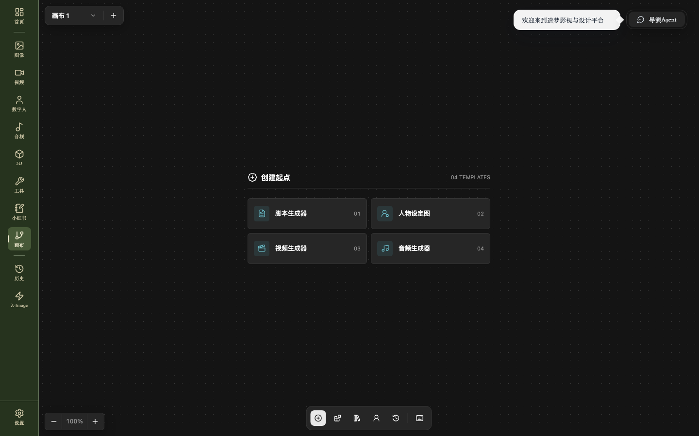

# 工作流画布使用手册

本文面向第一次使用 zmTV 的创作者，也可作为节点与画布交互的验收清单。



## 1. 进入画布

启动应用后，从左侧导航进入“画布”。画布在应用内容区域内打开，主导航仍然可用，便于随时切换到图片、视频、历史记录或设置。

画布区域分为四部分：

- 左侧画布列表：新建和切换多个画布。
- 中央无限画布：放置节点、连线、平移和缩放。
- 节点工具：创建文本、媒体、脚本、分镜和输出节点。
- 参数弹层：选择模型后显示该模型支持的模式与参数。

## 2. 管理多个画布

点击画布列表旁的新增按钮即可创建画布。每个画布拥有独立的节点、连线、视口和更新时间。

- 点击画布名称切换当前画布。
- 点击左上角名称可重命名。
- 桌面端会自动保存，重新启动后继续上次内容。
- 删除画布前确认其中没有仍需保留的生成结果。

## 3. 画布基础操作

| 操作      | 方式                                |
| --------- | ----------------------------------- |
| 平移画布  | 拖动空白区域或使用触控板            |
| 缩放      | 鼠标滚轮、触控板捏合或缩放控件      |
| 选择节点  | 单击节点                            |
| 多选节点  | 框选或按住修饰键逐个选择            |
| 移动节点  | 拖动节点标题区域                    |
| 建立连线  | 从输出端口拖到下游输入端口          |
| 删除      | 选中节点或连线后按 Delete/Backspace |
| 撤销/重做 | 使用顶部按钮或系统快捷键            |
| 自动布局  | 使用画布控制区的布局功能            |

普通脚本和表格节点在画布中以预览为主；进入全屏后再编辑，避免编辑内容时误拖动画布。

## 4. 节点类型

### 文本与脚本

用于提示词、对白、故事梗概、分镜脚本和结构化内容。文本可以连接到图片、视频、音频或导演节点。

### 图片生成器

支持文生图、图生图及模型声明的其他模式。选择模型后，画布从模型 schema 动态读取画面比例、分辨率、尺寸、质量和其他高级参数。

生成器输入框显示在节点下方；模型选择和常用参数位于生成弹层，其他模型专属参数位于更多参数区域。

### 视频生成器

模式由当前模型实际提供的 endpoint 决定，例如文生视频、首帧、尾帧、首尾帧、多图参考、全能参考、视频编辑或视频延长。切换模型后不会混入其他模型的模式。

视频节点通常显示比例、分辨率、时长和生成数量；有声视频开关仅在模型支持时出现。


### 音频、3D 与数字人

音频节点可承载语音、音乐和音效任务；3D 节点用于模型生成与预览；数字人节点处理角色图像、驱动音频或视频。三类节点均通过统一任务接口提交并轮询结果。

### 分组、播放列表和输出

分组节点用于整理大型工作流。播放列表和输出节点负责组织镜头顺序、预览或导出最终内容。

## 5. 模型、模式与动态参数

模型选择不是固定枚举。应用先从当前供应商获取模型目录，再按媒体类型过滤；选择模型后读取它的 endpoint 和 schema。

```text
供应商模型目录
  -> 媒体类型过滤
  -> 选择模型版本
  -> 读取该模型 endpoints
  -> 选择模式
  -> 加载对应 schema
  -> 渲染参数并提交
```

同一系列的不同版本必须保持独立，例如标准版、快速版和 mini 版不能因为名称相似而合并。一个模型拥有多个模式时，每个模式可以对应不同 endpoint。

## 6. 上传与引用素材

把图片、视频、音频或 3D 文件拖入画布即可创建相应素材节点。需要调用远程生成供应商时，桌面后端会先把本地文件转换为供应商可访问的公网 URL。

- 画布已经存在相同素材时，Codex 和工具优先引用已有节点，不重复创建。
- 图片与视频节点按素材原始宽高比创建占位，避免拉伸和过大的空白框。
- 角色图片可按平台能力执行 Seedance 合规校验，并原样显示平台返回的状态与提示。
- 不要将本机临时路径直接传给远程供应商。

## 7. 运行节点

1. 选择模型和模式。
2. 填写提示词或连接上游节点。
3. 检查当前模式要求的图片、视频、音频或首尾帧是否齐全。
4. 点击节点运行按钮。
5. 节点进入生成中状态并显示占位。
6. 桌面后端轮询供应商任务，成功后回填公网结果；失败时显示供应商原始错误信息。

切换应用页面不会取消生成任务。返回画布后，运行中占位和任务状态应继续存在。

## 8. 图片与视频工具栏

选中媒体节点后会出现上下文工具栏。图片工具包括多角度、重绘、扩图、裁剪、缩放、打光和其他预设；视频工具包括编辑、延长、首尾帧处理和镜头相关能力。

工具的提示词模板、输入尺寸规则和前后处理逻辑位于独立模块。调用生成供应商时才切换到桌面端统一接口，不能用简化提示词替换工具原有能力。


## 9. Codex 与导演 Agent

打开画布聊天后，从发送按钮旁选择可用的多模态文本模型。Codex 可以读取当前画布上下文、已有素材和节点关系，然后创建、连接或修改节点。

Codex 操作画布时：

- 新节点应创建在当前可视区域附近。
- 画布自动平移或缩放，使正在创建的节点可见。
- 媒体节点使用素材真实比例。
- 已有素材通过节点引用复用，不重复上传和创建。
- 生成任务仍使用桌面端图片、视频、音频、3D 和数字人接口及轮询逻辑。

导演 Agent 面向故事、角色、场景、镜头和时间线；可与脚本节点、批量分镜和 3D 导演控制台协同。

## 10. 保存与恢复

浏览器调试模式使用本地存储；Electron 桌面端还通过本地工作流后端保存项目、画布内容和任务数据。保存失败时，当前编辑会话应保持可用并显示错误。

公开仓库不包含任何用户数据库、生成历史、API Key、OSS 凭据或本地日志。

## 11. 常见问题

### 模型列表为空

打开 [造梦 API 开放平台](https://api.zaomeng.art)，确认账户令牌有效且有权使用对应模型。应用的 Base URL 已固定为 `https://api.zaomeng.art`；在设置页重新保存令牌并通过验证后刷新模型目录。

### 模式出现了其他模型的选项

检查模型合并键是否错误。模式必须来自当前选中模型的 endpoints，不能按模型系列名称合并。

### 一直显示生成中

检查提交响应中的任务 ID、任务类型前缀和轮询路由是否一致，并确认成功响应被归一化为画布可识别的结果 URL。

### 图片显示破图

检查结果是否仍是本地路径、临时 `blob:` URL 或已失效的对象 URL。需要供应商访问或跨会话恢复的素材必须先上传到平台文件服务并保存公网 URL。

### 打开聊天后画布卡顿

聊天消息渲染、流式响应和终端状态应与画布高频状态隔离。避免让聊天弹层订阅整个画布对象，也不要用覆盖画布的交互遮罩。
